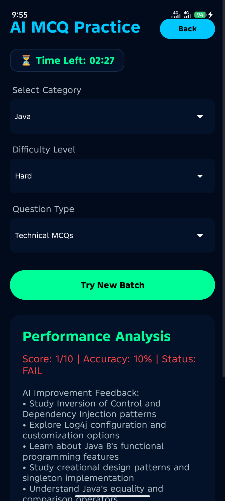
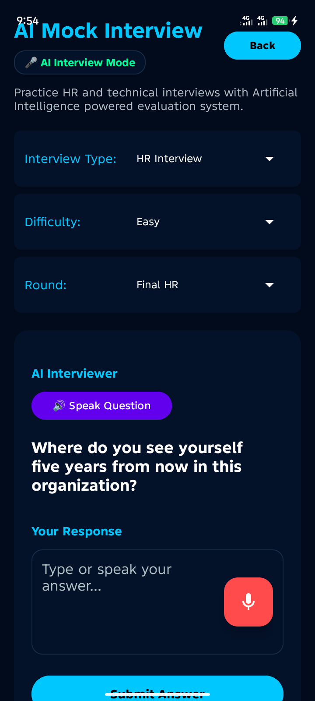
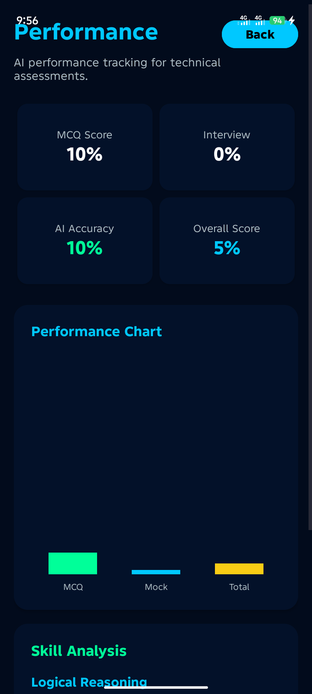

# AcePrep AI
An AI-powered preparation platform for technical MCQs and professional mock interviews.

## About the App
AcePrep AI is a professional Android application designed to help students and job seekers excel in technical assessments and interviews. It uses advanced Llama AI models to simulate real-world technical interview rounds and generate subject-specific MCQs. The app solves the problem of high-pressure interview anxiety by providing a 24/7 practice environment with real-time feedback, helping users improve their skills and confidence.

## App Screenshots
| User Login | User Dashboard | MCQs Practice |
|:---:|:---:|:---:|
|  |  |  |

| AI Interview | Job Letter | Performance |
|:---:|:---:|:---:|
|  |  |  |

## Features
- User signup & login
- AI MCQ Practice (8+ Technical Subjects)
- AI Mock Interview (Voice-enabled with score evaluation)
- AI Job-Specific Interviews (10+ Career Roles)
- Dynamic Performance Analytics & Progress Charts
- Global Leaderboard to track top performers
- Automated PDF Job Selection Letter Generation
- AI Resume Analyzer for CV improvement
- 24/7 AI Study Tutor Chatbot for "Gupshup" and queries

## Technologies Used
- Java (Android Studio)
- XML (Material Design UI)
- Firebase (Authentication & Firestore Database)
- Groq AI API (Llama 3.1 & 3.3 Models)
- OkHttp & Gson (Networking)
- PDFBox-Android (Document Generation)

## APK Download
[📥 Click Here to Download AcePrepAI APK](https://github.com/NaseemTechCraft/AcePrep-AI/raw/main/apk/AcePrepAI.apk)

## Documentation & Privacy Policy
- [View User Manual](docs/user_manual.pdf)
- [View Privacy Policy](docs/privacy_policy.pdf)

## How to Install the APK
1. **Download** the APK file from the link above.
2. **Transfer** it to your Android device (if downloaded on PC).
3. **Open** the file and **Allow installation from unknown sources** in settings.
4. **Install** and launch the application.

## How to Run the Project
1. Clone or download this project.
2. Open the project in Android Studio.
3. Sync Gradle files (`build.gradle.kts` and `settings.gradle.kts`).
4. Connect Firebase by adding your `google-services.json` to the `app/` directory.
5. Run the app on an emulator or Android device.

## Demo Video
[Watch Demo Video](https://www.youtube.com/watch?v=demo-video-link)

## Future Enhancements
- Integration with Video Interview Analysis
- Multi-language support (Urdu, Hindi, etc.)
- Dark/Light Mode toggle
- Advanced institutional reports for teachers

## Developed By
**Naseem Hayyat**  
BS IT / Semester 6  
Department of Information Technology  
University of Layyah  

**GitHub:** [NaseemTechCraft](https://github.com/NaseemTechCraft)  
**LinkedIn:** [Naseem Hayyat](https://www.linkedin.com/in/mnaseem-hayyat-687716407)
